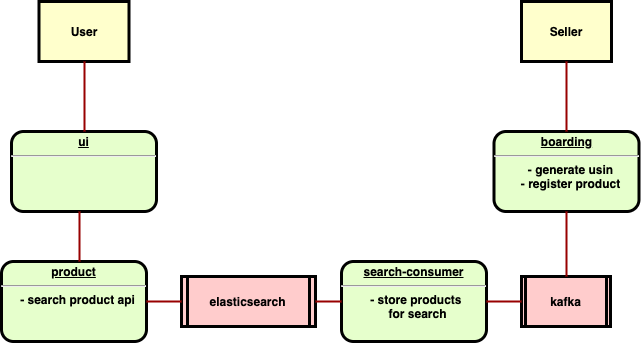

## Structure



## Features roadmap

- dockerization
- authentication
- payment (stripe)

## Build the project

```shell
./gradlew clean build -x test
```

## Run the project with docker-compose

1) create a network for all the docker-compose configurations
```shell
docker network create ecommerce
```

2) Run all the configuration with docker-compose
```shell
docker-compose -f docker-compose.base.yml -f docker-compose.service.yml -f docker-compose.ui.yml up --build
```

## Available endpoints

- http://localhost:3001 - service-api-gateway
- http://localhost:3002 - service-ui
  
- http://localhost:8081 - service-boarding api
- http://localhost:8082 - service-product api

---

http://127.0.0.1:4455/.ory/kratos/public/self-service/login/browser
http://127.0.0.1:4455/.ory/kratos/public/self-service/registration/browser
http://127.0.0.1:4455/.ory/kratos/public/self-service/logout/browser
http://127.0.0.1:4433/self-service/login/browser
http://127.0.0.1:4433/self-service/registration/browser
http://127.0.0.1:4455/self-service/login/flows?id=d143be8a-b914-4a8f-b5b1-23f0b7eacbc6

sudo certbot --nginx -d ultimate-ecommerce.v-query.com -d auth.ultimate-ecommerce.v-query.com -d mail.ultimate-ecommerce.v-query.com

docker-compose -f docker-compose.base.yml -f docker-compose.service.yml -f docker-compose.ui.yml -f docker-compose.auth.yml up --build -d


## Scripts

### import-products.js

```shell
ENDPOINT=127.0.0.1 DATA_PATH=products-sample.json node scripts/import-products.js
```